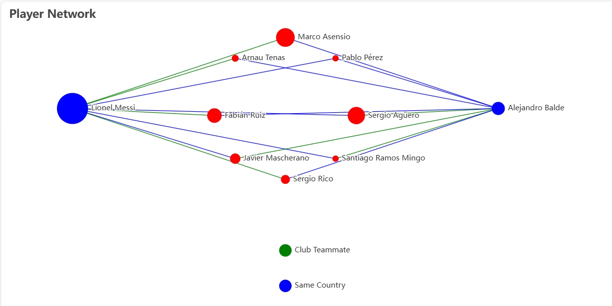
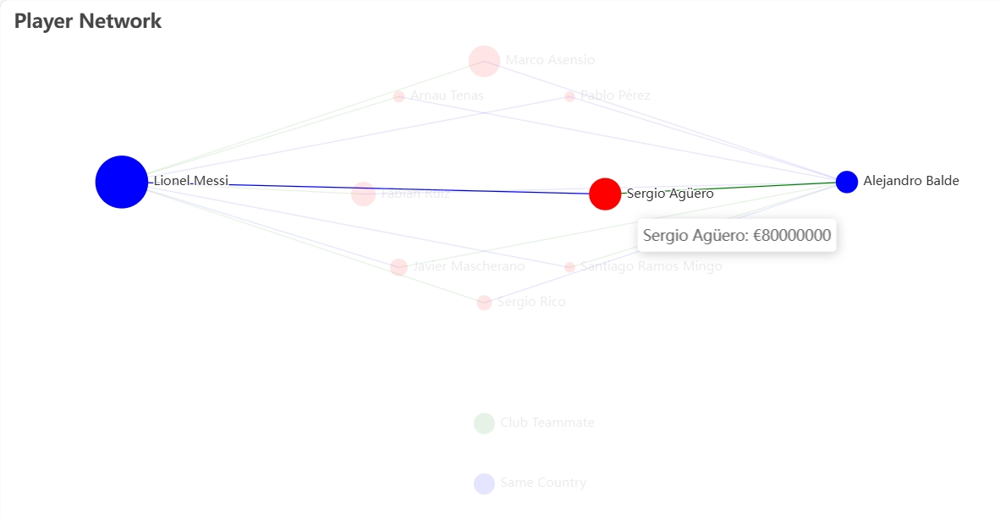

# SI507 Final Project Checkpoint

Zhonghan Xie (jonasxie)  
U-M ID: 83866049  
12/2/2024  

My original proposal is **International Trade (Import & Export) Network Analysis and Visualization**. But I found accessing the data is pretty difficult. Based on the availability of the data, I switched my project to **Visualizing Football (Soccer) Player Network**. The new project aims to analyze and visualize the relationships (club teammates or from the same country) between football players in the major European leagues. The network will help us better understand the relationships between players and clubs in the football world.

## Data Sources

[Football Data from Transmarkt](https://www.kaggle.com/datasets/davidcariboo/player-scores): It is a Kaggle dataset that contains the players and clubs in the major European leagues. The dataset is scraped from a credible football data website, Transfermarkt. The data includes the players' names, clubs, and countries. The data is also updated on a weekly basis.  
I am also looking for other possible data sources to enrich the dataset.  

## Data Analysis and Visualization  

### Network Analysis

1. Identify the player of the highest market value in the network.
2. Visualize the player network between selected two players.
3. Identify the shortest path between two players in the network.
4. Identify the players with the most common teammates.

### Data Visualization

I will use the `networkx` library to create the player network with the connecting players between the players of interest. I will also use the `pyecharts` library to create an interactive visualization of the player network. I attached a simple example visualization of the player network between Lionel Messi and Alejandro Balde below.

The players from the same country are connected in green lines. The players from the same club are connected in blue lines. The player market value is represented by the size of the node.

With the help of the `pyecharts` library, hover on the nodes will highlight the connecting path and show the player's name and market value.

## Plan for the Next Steps

1. Identify the playeys with the most common teammates.
2. Consider add the national team?
3. Design an interface to select the player the visualize their own network or the network between two players.

## Questions for the Instructor

1. Is the data source credible enough for the project?
2. Am I allowed to use the `networkx` library for the network analysis?
3. Any suggestions for the data visualization? or research ideas?